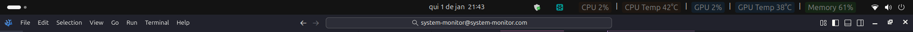

# GNOME Extension Metrics

## English README

This GNOME extension displays 5 key metrics at the top of Ubuntu:
- CPU Usage
- CPU Temperature
- GPU Usage
- GPU Temperature
- Memory Usage

### Features
- Real-time monitoring
- Clean and minimal interface
- Lightweight performance
- Easy to install and use

### Installation
1. Clone this repository
2. Run `make install`
3. Restart GNOME Shell (Alt+F2, type 'r', press Enter)

### Requirements
- GNOME 40+
- Ubuntu 21.04+

## How to Test the Extension

To test this extension:

1. Make sure you have the dependencies installed:
   - `nvidia-smi` (for NVIDIA GPU monitoring)
   - `sensors` (for temperature readings)

2. Install the extension following the steps above.

3. Restart GNOME Shell with `Alt+F2`, type `r` and press Enter.

4. The extension should appear on the panel, displaying real-time metrics.

5. To disable the extension:
   - Use the GNOME Extensions app
   - Disable the "System Monitor" extension
   - Restart the GNOME Shell again

6. To re-enable:
   - Activate it again through the GNOME Extensions interface
   - The panel will update automatically

## README em Português

Esta extensão do GNOME exibe 5 métricas importantes no topo do Ubuntu:

- Uso da CPU
- Temperatura da CPU
- Uso da GPU
- Temperatura da GPU
- Uso da Memória

### Recursos
- Monitoramento em tempo real
- Interface limpa e minimalista
- Baixo consumo de recursos
- Fácil instalação e uso

### Instalação
1. Clone este repositório
2. Execute `make install`
3. Reinicie o GNOME Shell (Alt+F2, digite 'r', pressione Enter)

### Requisitos
- GNOME 40+
- Ubuntu 21.04+

## Como Testar a Extensão

Para testar esta extensão:

1. Certifique-se de que você tem as dependências instaladas:
   - `nvidia-smi` (para monitoramento da GPU NVIDIA)
   - `sensors` (para leitura de temperaturas)

2. Instale a extensão seguindo os passos acima.

3. Reinicie o GNOME Shell com `Alt+F2`, digite `r` e pressione Enter.

4. A extensão deve aparecer na barra de tarefas, exibindo as métricas em tempo real.

5. Para desativar a extensão:
   - Use o GNOME Extensions app
   - Desative a extensão "System Monitor"
   - Reinicie o GNOME Shell novamente

6. Para reativar:
   - Ative novamente pela interface do GNOME Extensions
   - O painel será atualizado automaticamente
